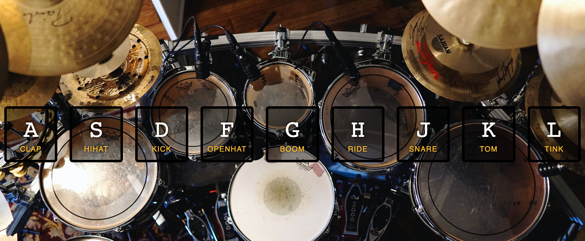

# Title: Drum Set

---

Description: This first project is a drum set that you play using your computer keyboard. There are a total of nine keys that each have a different part of the drum set. This project uses audio files to make the sounds of the drum set. A screen shot of the completed set is below.

Technologies used: HTML, CSS and Javascript, Chrome Dev Tools, Git, GitHub and VS Code.

This is the first of the 30 daily Javascript projects I am working on.

### My notes and experience on this project.

This first project took me two days or around 2 hours to complete. The video that Wes Bos created to build this app was just under 20 minutes in total time.

I had issues with getting some of the console.logs to appear in the Chrome broswer console. I checked the errors in Google and found some articles in Stack OverFlow. None of the suggested solutions I found worked or I couldn't figure out how to implement them.

The final code was not working because I misspelled the word **transitionend** with **transitioned**. This mistake cause me to watch the video a second time and spend another hour and a half trouble shooting the error. I looked at the finished code to compare it to my code. The finished code looked different than the code Wes wrote in the video. Before I found the mistake in my code, which was nearly the last line of code, I made all of the changes that were shown in the finished code.

This project reminded me the pains of writing in Javascript. I don't fully understand every reason Wes gave for writing the code as he did. But overall I am happy with the project working and that the project was a drum kit. I enjoy banging on a good drum set and an electonric one is pretty cool too. This is a completed project I can see myself using from time to time to relieve stress!!

:notes:

Screen Shot:

